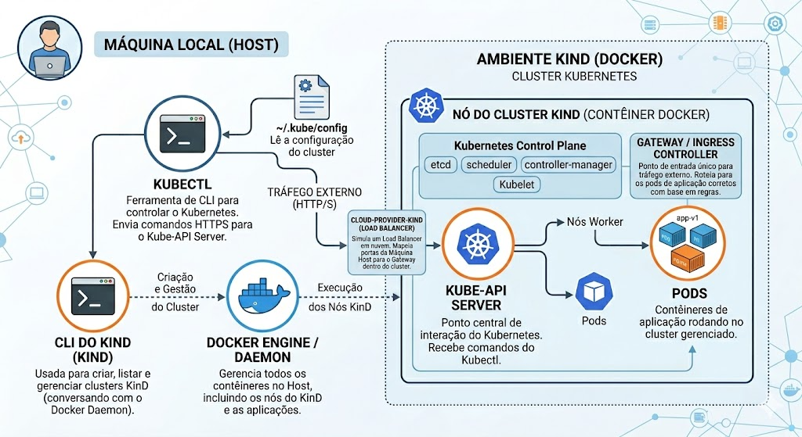

# EASY K8S LOCAL
O objetivo desse repositório é orientar de forma facil como utilizar o Kubernetes localmente.   
Usaremos as ferramentas: **Docker**, **KinD** e **Kubectl** para montarmos um cluster funcional e leve.

**Funciona apenas nos sistemas Linux/WSL2 e MacOS**

## Dependências

- [Docker](https://www.docker.com) / [Podman](https://podman.io/)
- [KinD](https://kind.sigs.k8s.io)
- [Kubernetes Cloud Provider for KinD](https://github.com/kubernetes-sigs/cloud-provider-kind)
- [Kubectl](https://kubernetes.io/docs/reference/kubectl/)

Voce pode optar por usar o [Docker](https://www.docker.com) ou [Podman](https://podman.io/) (o script de automação vai checar quem esta instalado nessa ordem), recomendo olhar nos respectivos sites para obter informações mais adequedas para a instalação.   
As demais dependencias, eu recomendo instalar via [Brew](https://brew.sh/) com o comando: 
```sh
brew install kind cloud-provider-kind kubectl
```

## Como o Kubernetes Funciona e onde o KinD se encaixa

### O que é e como funciona o Kubernetes?

Em suma, o **Kubernetes** (frequentemente abreviado como **K8s**) é uma plataforma de **orquestração de contêineres** de código aberto. Pense nele como o maestro de uma orquestra de aplicações: ele garante que todos os "instrumentos" (seus contêineres de aplicação) estejam tocando juntos, na hora certa, no volume correto e que, se um músico faltar, outro o substitua imediatamente.

Sua função principal é **automatizar** a implantação, o dimensionamento e o gerenciamento de aplicações que foram empacotadas em contêineres (como os criados pelo Docker).

#### Conceitos e Componentes Chave:

1.  **Cluster:** É o conjunto de máquinas (físicas ou virtuais) gerenciadas pelo Kubernetes. Ele é dividido em dois tipos de nós:
    * **Nó Mestre (Control Plane):** O "cérebro" do cluster. Ele toma decisões sobre onde rodar as aplicações, monitora o estado do cluster e reage a falhas. Contém componentes como o **API Server** (o ponto de entrada para comandos), o **Scheduler** (que decide em qual nó uma aplicação vai rodar) e o **etcd** (um banco de dados chave-valor que guarda toda a configuração e estado do cluster).
    * **Nó do Trabalhador (Worker Nodes):** As máquinas que realmente executam as suas aplicações. Eles recebem instruções do Nó Mestre. Contém componentes como o **Kubelet** (um agente que garante que os contêineres estejam rodando no nó) e um **Container Runtime** (como o Docker ou containerd, que de fato executa os contêineres).

2.  **Pod:** É a menor unidade implantável no Kubernetes. Um Pod representa uma instância de um processo em execução no cluster e pode conter um ou mais contêineres que compartilham recursos como rede e armazenamento.

#### Principais Funcionalidades de Automação:

* **Implantação e Rollback:** Facilita o lançamento de novas versões de uma aplicação e permite voltar rapidamente à versão anterior em caso de erro.
* **Escalonamento Automático:** Aumenta ou diminui o número de instâncias de uma aplicação (Pods) baseado na demanda de tráfego.
* **Auto-cura (Self-healing):** Se um contêiner ou nó falhar, o Kubernetes automaticamente reinicia o contêiner ou move a aplicação para um nó saudável.
* **Balanceamento de Carga e Descoberta de Serviço:** Dá nomes de rede próprios para as aplicações e distribui o tráfego de rede entre as instâncias da aplicação para garantir estabilidade.

### Onde entra a ferramenta KinD usando o Docker?

**KinD** significa **"Kubernetes in Docker"**. É uma ferramenta projetada para criar e gerenciar clusters Kubernetes **locais** usando contêineres Docker para simular os nós do cluster.

#### Como funciona a simulação com o KinD e Docker?

Em um ambiente de produção real (como AWS, Google Cloud ou Azure), um cluster Kubernetes é composto por várias máquinas físicas ou máquinas virtuais (VMs) separadas, cada uma atuando como um Nó Mestre ou um Nó do Trabalhador.



O KinD simplifica tudo isso drasticamente para fins de **desenvolvimento e teste**:

1.  **Docker como Infraestrutura:** Em vez de provisionar máquinas virtuais pesadas na nuvem ou localmente (com VirtualBox, por exemplo), o KinD usa o **Docker** já instalado na sua máquina host (seu notebook ou desktop).
2.  **Nós como Contêineres:** Quando você cria um cluster com o comando `kind create cluster`, o KinD instrui o Docker a iniciar **contêineres Docker especiais**.
3.  **A "Mágica" do Contêiner do KinD:** Cada um desses contêineres especiais do KinD não é um contêiner de aplicação comum. Ele vem pré-configurado com uma imagem de sistema operacional leve e **todos os componentes necessários de um nó Kubernetes** instalados dentro dele (como o Kubelet, um tempo de execução de contêiner interno como containerd, o API Server, etc.).
    * Um contêiner do Docker vai "fingir" ser o seu Nó Mestre.
    * Outros contêineres do Docker vão "fingir" ser os seus Nós do Trabalhador.

#### O Fluxo na Sua Máquina Local:

* Você tem o **Docker** rodando.
* Você roda a ferramenta de CLI do **KinD**.
* O KinD baixa uma imagem de nó pré-construída (que contém o Kubernetes) do Docker Hub.
* O KinD sobe contêineres Docker baseados nessa imagem.
* Agora você tem um cluster Kubernetes funcional rodando **inteiramente dentro de contêineres Docker na sua máquina**.

**Resumo da vantagem:** O KinD oferece uma maneira extremamente rápida, leve e gratuita de ter um cluster Kubernetes "de verdade" para testar suas aplicações localmente, sem a complexidade ou custo de criar VMs ou provisionar recursos na nuvem.

## Criando o Cluster K8S

### !!! Script facilitador !!!
Foi criado em Python um script para facilitar a inicialização do cluster:
```sh
./easyk8s
```
Pressione `Ctrl+C` para cancelar o script e encerrar o load balancer, o cluster e o registry.

> Caso queira saber o procedimento manual, seguir os passos abaixo.

> Usando o `Podman`, o `registry-local` só funcion corretamente se [desativar a conexão segura (HTTPS)](#podman--localregistry-desativar-conexão-segura).

### 1. Passo - Iniciar o Cluster junto com o Local Registry
```sh
./script/kind-with-registry.sh
```
> Script não prende o terminal.

**Local Registry** é o servidor/repositório local de imagens `Docker`. Ele é necessario quando se faz a construção (`build`) de uma nova imagem e precisa utilizar a mesma no manifesto de `deployment`, pois ele só utiliza imagens previamente armazenadas em um repositório.

Todas as imagens Docker precisarão iniciar com o endereço do local do registry.
Vou dar um exemplo:
```yaml
services:
  api-service:
    image: localhost:5001/minha-aplicacao:latest
    container_name: api-container
    build:
      dockerfile: Dockerfile
      context: .
    command: uvicorn main:app --host 0.0.0.0 --port 8000
    ports:
      - "8000:8000"
    environment:
      - TZ=America/Sao_Paulo
```

No `docker-compose` acima, o repositorio é o host do servidor `localhost:5001` mais o repositorio `minha-aplicacao` e a tag `latest`.

Após o build, é necessario fazer o `push` para que a imagem seja registrada no servidor de registry e consequentemente o Kubernetes conseguir puxar ao iniciar a aplicação.

> Usando o `Podman`, o `registry-local` só funcion corretamente se [desativar a conexão segura (HTTPS)](#podman--localregistry-desativar-conexão-segura).

### 2. Passo - Iniciar o Load Balancer
Liberar as permissões requeridas:
```sh
kubectl label node kind-control-plane node.kubernetes.io/exclude-from-external-load-balancers-
``` 
> Script não prende o terminal.

Iniciar o Load Balancer:
```sh
cloud-provider-kind
```
> Binario prende o terminal.

Feito isso, o `KinD` vai garantir a exposição correta do IP e da porta ao executar manifesto de `ingress` da aplicação.

## Teste
Apos iniciar o cluster do k8s, iniciar a aplicação de teste com o seguinte comando:
```sh
kubectl apply -k k8s/local
``` 

Para validar se esta tudo funcionado, vamos fazer request nas aplicações (`bar-app` e `foo-app`) executando o script:
```sh
./script/test-ingress.sh
```

O output deve conter algo assim quando der certo:
```txt
curl -i 172.20.0.4/foo

HTTP/1.1 200 OK
date: Thu, 09 Apr 2026 02:01:23 GMT
content-length: 7
content-type: text/plain; charset=utf-8
x-envoy-upstream-service-time: 0
server: envoy

foo-app

---
curl -i 172.20.0.4/bar

HTTP/1.1 200 OK
date: Thu, 09 Apr 2026 02:01:24 GMT
content-length: 7
content-type: text/plain; charset=utf-8
x-envoy-upstream-service-time: 0
server: envoy

bar-app
```

## Extras

### Podman + LocalRegistry: Desativar conexão segura HTTPS
Criar/Editar o arquivo de configuração `~/.config/containers/registries.conf` adicionado as seguintes informações:
```sh
[[registry]]
location = "localhost:5001"
insecure = true
```
